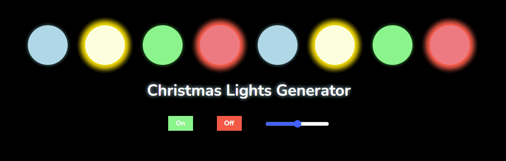

# Christmas Lights Simulator
Simulador de luzes de Natal, feito para o desafio do [AppIdeas](https://github.com/florinpop17/app-ideas). Veja uma [demo aqui](https://codepen.io/gustavoaqm/pen/eYVOXRg).

O aplicativo ChristmasLights conta com seus talentos de desenvolvimento para criar
uma exibição de luz hipnotizante. Sua tarefa é desenhar sete círculos coloridos
em uma linha e com base em um temporizador altere a intensidade de cada círculo. Quando
um círculo é iluminado, seu predecessor retorna à sua intensidade normal.

Isso simula o efeito de uma sequência de luzes ondulantes, semelhantes às
exibido durante as festas de Natal.

##  Regras

-    [x] O usuário pode pressionar um botão para iniciar e parar a exibição
-    [x] O usuário pode alterar o intervalo de tempo controlando a mudança de intensidade
